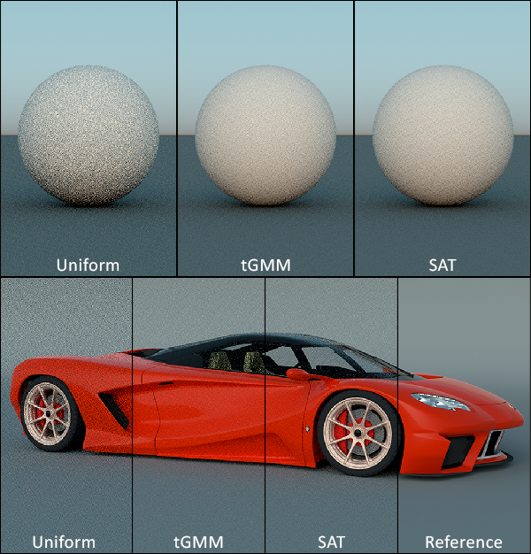

# Sampling Clear Sky Models using Truncated Gaussian Mixtures

## Overview
This repository contains the source code that is part of the supplemental material for the *[EGSR 2021 Paper: Sampling Clear Sky Models using Truncated Gaussian Mixtures](https://#)* (**TBD**). The contents are:

- Python script for the fitting process
- Reference implementation as a PBRTv3 plugin for infinite area light sources.
- Pre-trained models for Preetham and Hosek sky models.
- Test renderings for various scenes

Some additional quick links
- [Author version](https://#) (**TBD**) of the paper
- YouTube [short video presentation](https://#) (**TBD**) (3 min)



### Table of Contents

- [Overview](#Overview)
- [Usage Instructions](#Usage-Instructions)
- [How to Cite](#How-to-Cite)
- [Acknowledgments](#Acknowledgments)

## Usage Instructions

The folders are:
- [cpp_sky_gen_code](cpp_sky_gen_code), contains C++ source code for the generation of radiance and luminance maps for the Hosek and Preetham models. See README.txt for the compilation of the tool. A compiled executable is also provided for convenience.
- [dataset](dataset), contains a subset of the dataset for the Hosek and Preetham sky models
- [pbrt](pbrt), containing the PBRT-v3 code for plugging in the tGMM source code
- [python_fitting_code](python_fitting_code), encompassing the Python 3 source code for the fitting process and visualisation utilities
- [screenshots](screenshots), including all rendered images that were included in the paper plus additional ones, for reference. The file naming convention is: <model>_<elevation>_<turbidity>_<spp>_<sampling_method>_<importance_sampling>. For example: barcelona-pavilion_23_4_4_gmm_mis, elevation: 23, turbidity: 4, spp: 4, Sampling method: tGMM, MIS enabled: Yes. To reduce content size, files have been converted to PNG format.

### Sky Maps

To build the sky maps tool:
- Open a Visual Studio x64 command line console.
- Change directory to the [cpp_sky_gen_code](cpp_sky_gen_code) folder.
- Dependencies
    - **TinyEXR** (header only - included)
    - **FreeImage** (compiled, included for Windows|x64)
- Dependencies Folder
    - **include** folder for FreeImage and TinyEXR headers
    - **lib/x64** for **FreeImage.lib** and **FreeImage.dll**
    - The **FreeImage.dll** needs to be manually copied to the executable folder

- Run the following command for MSVC:
    ```shell
    cl /O2 /MT /D "_CONSOLE" /D "_UNICODE" /D "UNICODE" SunSky.cpp SunSkyTool.cpp /I "include" /link /LIBPATH:"lib/x64" "FreeImage.lib"
    ```
or    
- Run the following command for Clang:
    ```shell
    * clang++.exe -O2 SunSky.cpp SunSkyTool.cpp -Iinclude -L"lib/x64" -o SunSky.exe -lFreeImage
    ```
This generates the executable 'SunSky.exe'

To generate sky maps and dataset, Go to [cpp_sky_gen_code](cpp_sky_gen_code) folder and run:
```shell
SunSky.exe -s Hosek -p    (for Hosek)
SunSky.exe -s Preetham -p (for Preetham)
```

### Python
To run the scripts that generate the dataset and perform the fitting process, go to the [python_fitting_code\skymodel](python_fitting_code\skymodel) folder and run **main.py**.

The provided functionality for the script is:
```
python main.py -h
usage: main.py [-h] 
               [--generateDataset input directory output_directory]
               [--best_num_gaussians min_value max_value] 
               [--fit] 
               [--plot]
               [--visualize_model model name max_GMMs_to_show]
               [--skymapdir skymap directory] 
               [--outdir output directory]

optional arguments:
  -h, --help            show this help message and exit
  --generateDataset input directory output_directory, -g input directory output_directory
                        Generates the dataset for the fitting process.
  --best_num_gaussians min_value max_value, -b min_value max_value
                        Performs fitting and stores the best GMM count.
                        Expects min max arguments.
  --fit, -f             Fits the .tiff skymap files in the skymap dir
  --plot, -p            Plots the result during fitting
  --visualize_model model name max_GMMs_to_show, -v model name max_GMMs_to_show
                        Visualises up to 'max_GMMs' from the model
  --skymapdir skymap directory, -s skymap directory
                        Sky Model PDF directory. Default is
                        ../../dataset/hosek/hosek_sky_luminance
  --outdir output directory, -o output directory
                        Output directory. Default is fit
```

For example, to generate luminance sky maps: 
```shell
python main.py --generateDataset ..\..\dataset\hosek\hosek_sky ..\..\dataset\hosek\hosek_sky_luminance
```
Additionally, to run the fitting process (output at fit\model.csv):
```shell
python main.py --fit --skymapdir ..\..\dataset\hosek\hosek_sky_luminance --outdir fit
```

### PBRT

Simply replace the files in the [pbrt](pbrt) source code directory. The important files are: 
- **infinite_gmm**, containing the tGMM infinite light implementation
- **infinite_uniform**, containing the naive uniform sampling for comparison purposes

## How to Cite
The license is [Apache 2.0](LICENSE). If you use the contents of this repository for your work, please cite it as described below:

### LaTeX and BibTeX example usage

<blockquote>
<pre style="white-space:pre-wrap;">
In our work, we have used the source code~\cite{Vitsas_EGSR_2021}, available at <em>'https://github.com/cgaueb/tgmm_sky_sampling'</em>.
</pre>

<pre style="white-space:pre-wrap;">
@article{Vitsas_EGSR_2021,
    booktitle = {Eurographics Symposium on Rendering - DL-only Track},
    editor = {Bousseau, Adrian and McGuire, Morgan},
    title = {{Sampling Clear Sky Models using Truncated Gaussian Mixtures}},
    author = {Vitsas, Nick and Vardis, Konstantinos and Papaioannou, Georgios},
    year = {2021},
    publisher = {The Eurographics Association}
}
</pre>
Note: A proper bibtex will be uploaded when the paper gets published.
</blockquote>

## Acknowledgments
The provided sky map generation utility is based on a modified version of the excellent library by Andrew Willmott available [here](https://github.com/andrewwillmott/sun-sky).
The breakfast room scene was downloaded from [Benedikt Bitterli’s rendering resources](https://benedikt-bitterli.me/resources/). All remaining scenes were
obtained from the [PBRT-v3 scene repository](https://www.pbrt.org/scenes-v3.html).
